<h3>ONLINE EXAMINATION PORTAL</h3>
    

    

        <h3>PROJECT REQUIREMENTS</h3>
        <ol>
            <li>SOFTWARE REQUIREMENTS</li>
            <ol>
                <li>JDK</li>
                <li>APACHE TOMCAT</li>
                <li>MySQL</li>
            </ol>
            <li>JAR / OTHER LIBRARIES</li>
            <ol>
                <li>activation.jar ( WEB-INF/lib )</li>
                <li>javax.mail.jar ( WEB-INF/lib )</li>
                <li>mysql-connector-java.jar ( WEB-INF/lib )</li>
            </ol>
            <li>CHANGES REQUIRED</li>
            <ol>
                <important>NOTE: CHANGE "mail@gmail.com", "password" WITH YOUR OR SENDER'S MAIL ADDRESS AND PASSWORD</important>
                <li>addRecord.java ( WEB-INF/classes )</li>
                <li>adminMail.java (WEB-INF/classes )</li>
                <li>deleteRecord.java ( WEB-INF/classes )</li>
                <li>updateUserRecord.java ( WEB-INF/classes )</li>
                <li>userMail.java ( WEB-INF/classes )</li>
            </ol>
        </ol>
    

        <h3>SCREENSHOTS</h3>
        

            <h3>HOME PAGE</h3>
            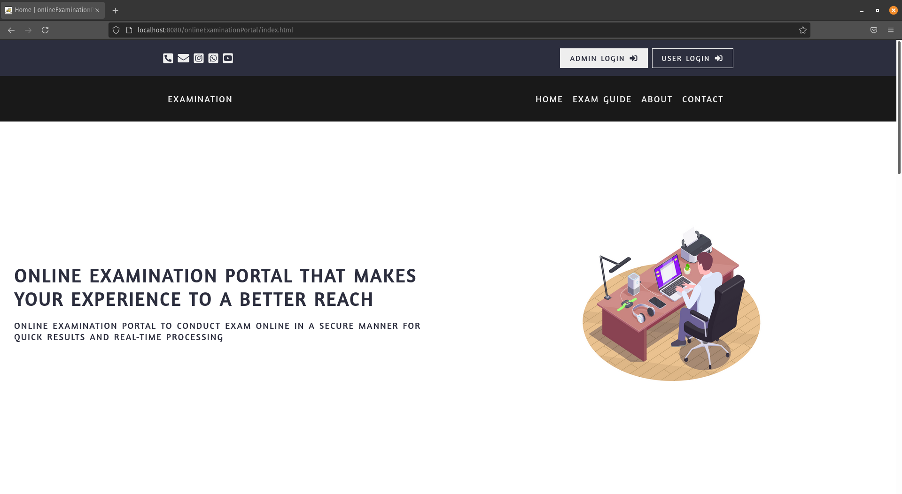
            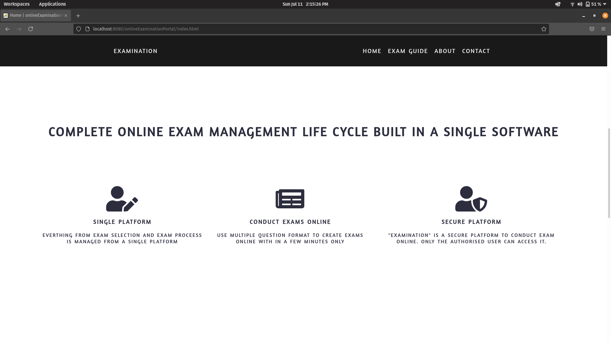
            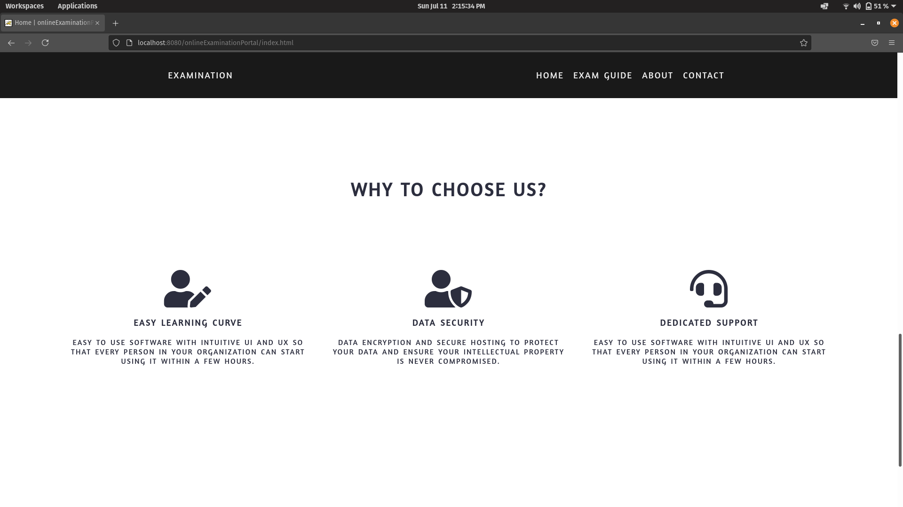
            

            <h3>ADMIN PAGE</h3>
            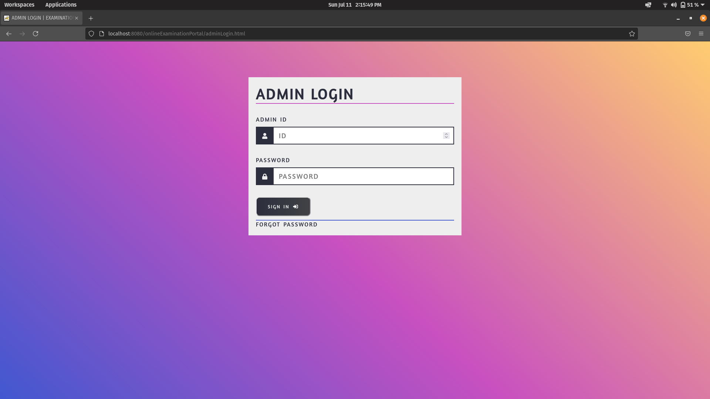
            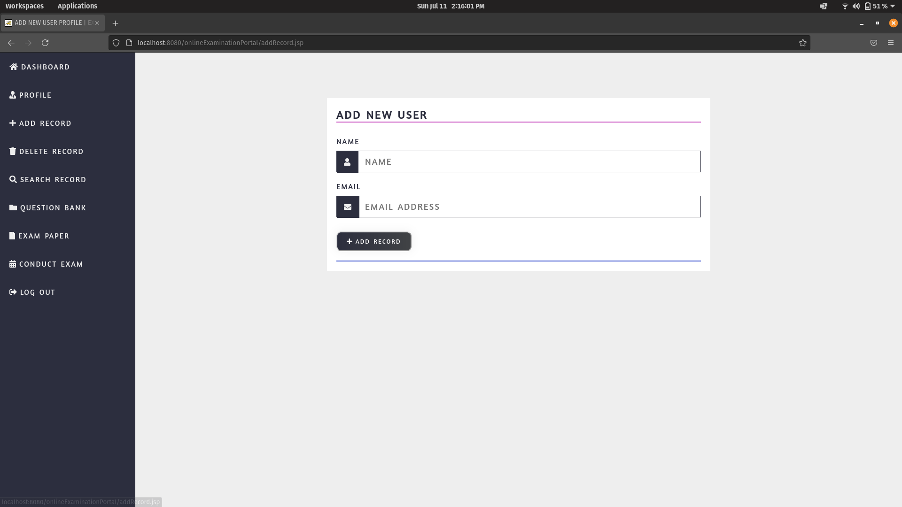
            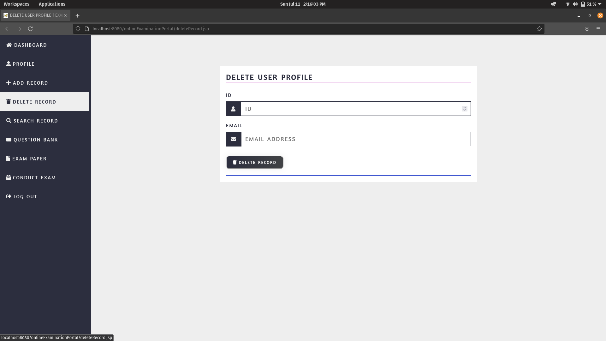
            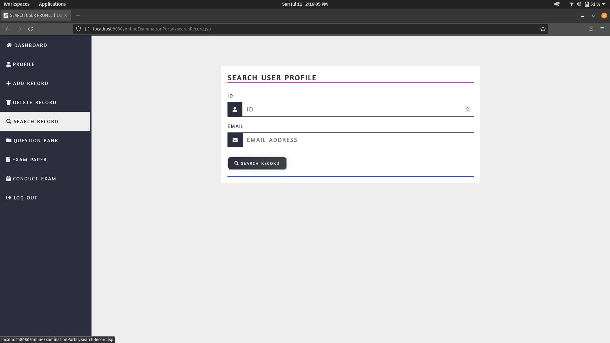
            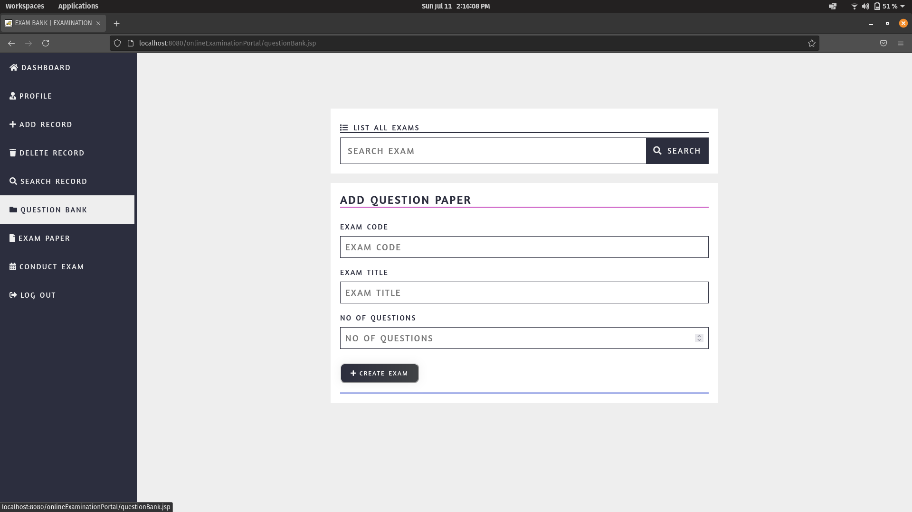
            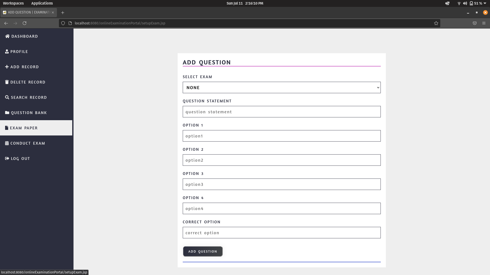
            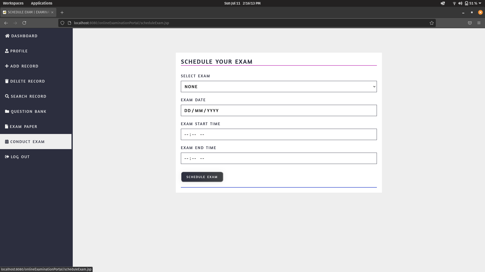
            

            <h3>USER PAGE</h3>
            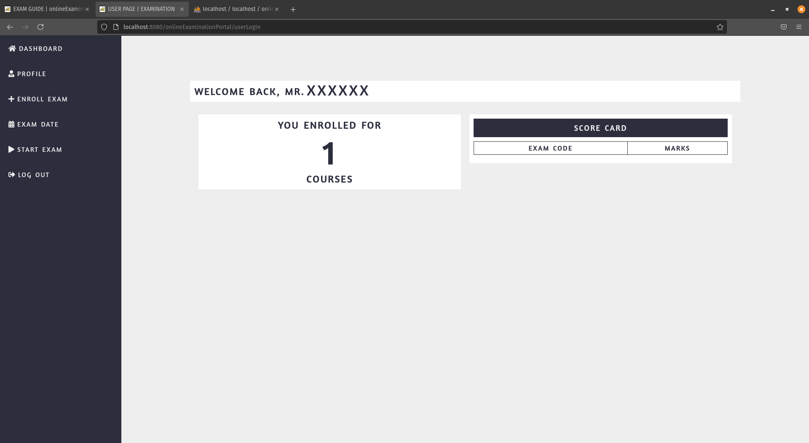
            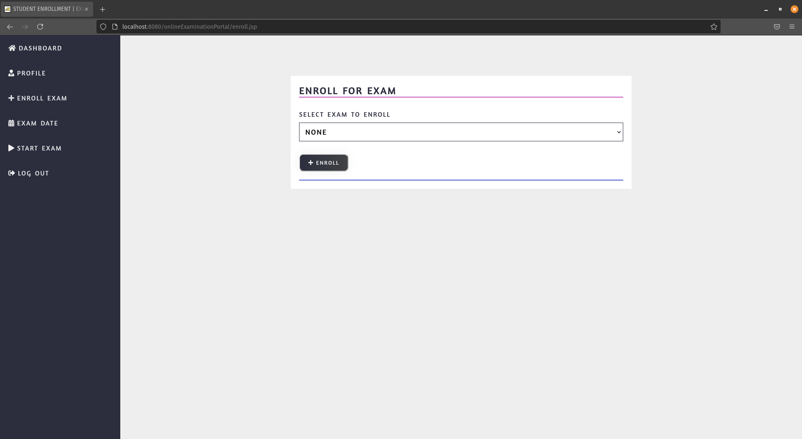
            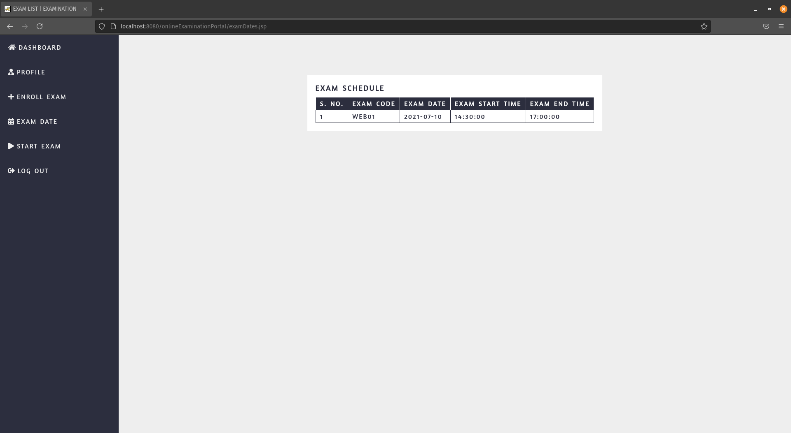
            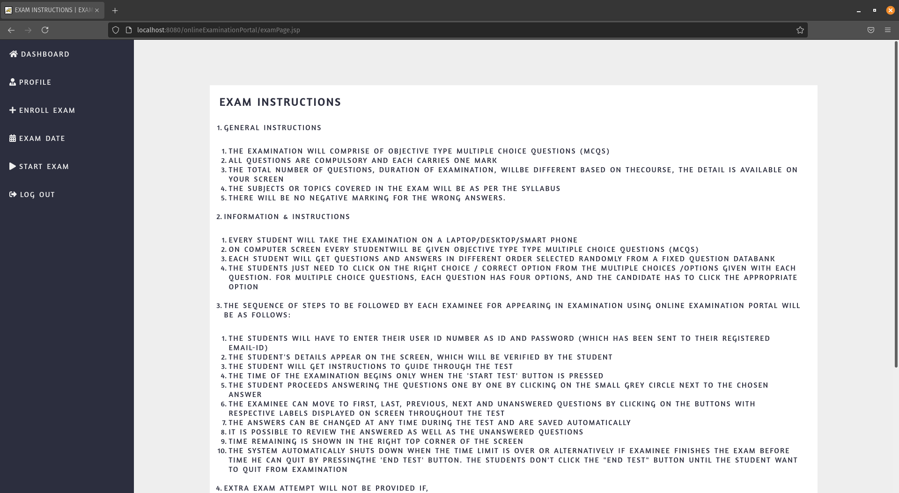
            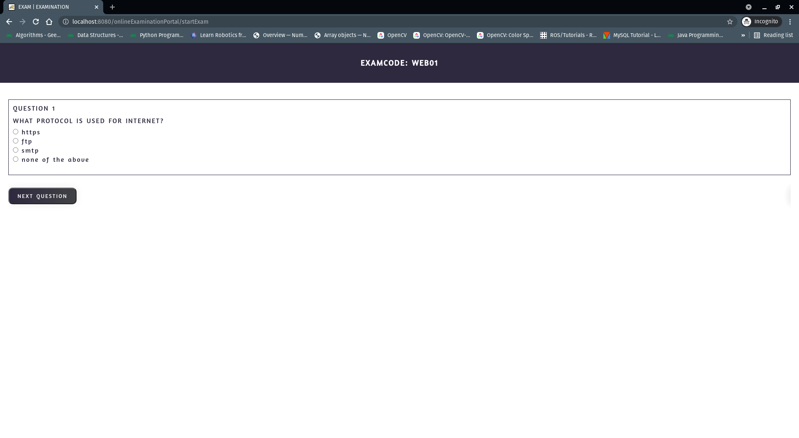
        

    

